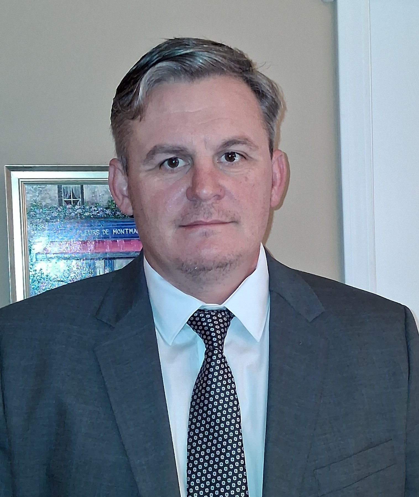

# David Walgamotte

## 📬 Contact Information
* **Email:** walgamotte@proton.me

## 📌 Summary
Detail-oriented GRC and Cybersecurity Professional with experience driving information security, risk management, and regulatory compliance across major financial institutions and defense environments. Expert in conducting comprehensive risk assessments, authoring enterprise security policies, and mapping technical controls to NIST SP 800-53, RMF, and ISO 27001 frameworks. Proficient in leveraging Automation-as-Code to streamline compliance tracking, vulnerability remediation, and identity management across cloud infrastructures.

## 🛠 Skills
*   **Frameworks & Compliance:** NIST SP 800-53 (Rev 4/5), Risk Management Framework (RMF), FedRAMP, SOC 2, ISO 27001
*   **Governance & Risk Assessment:** Policy Authoring, Threat Modeling, Third-Party/Vendor Risk Management (TPRM), Cloud Security Assessments
*   **Security Automation:** Python, Open Security Controls Assessment Language (OSCAL), Shell Scripting, PowerShell
*   **Identity & Access Management:** Identity and Access Management (IAM), Multi-Factor Authentication (MFA), Smartcard Management Systems
*   **Vulnerability & Operations:** Splunk, ACAS, Nessus, Wazuh, Host Based Security System (HBSS), Linux/UNIX & Windows Administration

## 💼 Professional Experience

### Freelance Consultant / Independent Contractor
**Self-Employed** | *January 2024 – Present*
*   Provide IT support and perform break-fix repairs.
*   Utilized gig-economy platforms to deliver on-demand services during a targeted job search.

### Senior Information Security Engineer
**Wells Fargo** | *January 2016 – January 2024*
*   Conducted rigorous security and compliance assessments of enterprise applications, SaaS architectures, and public cloud environments across AWS, Azure, and GCP.
*   Evaluated product security posture, focusing heavily on cryptographic controls for data-at-rest and data-in-transit to protect sensitive financial services data.
*   Led cross-functional remediation efforts alongside software development groups to harden systems and ensure line-of-business deployments conformed to banking regulations.
*   Implemented technical controls and drafted standard operating procedures (SOPs) to optimize day-to-day security operations.
*   Managed the enterprise smartcard management system to enforce identity verification and maintain robust network access control.

### Information Security Officer
**Cosolutions** | *January 2010 – January 2016*
*   Delivered secure UNIX, Linux, and Windows system baselines for Navy SPAWAR Atlantic, leveraging Shell, Python, and PowerShell scripting to automate secure configurations.
*   Led comprehensive NIST-based security assessments to evaluate control effectiveness and strengthen the command’s overarching cyber defense posture.
*   Administered, monitored, and audited configuration baselines across multi-platform networks to systematically track and mitigate infrastructure vulnerabilities.
*   Deployed and managed core cybersecurity suites, including Splunk, ACAS, Nessus, and Norton HBSS, ensuring real-time visibility into security events.

### UNIX Administrator
**SAIC** | *January 2006 – January 2010*
*   Administered Entergy Solaris and Linux servers within production data centers, maximizing infrastructure uptime and maintaining an audited security posture.
*   Configured, provisioned, and managed system user accounts, directory permissions, and explicit access control lists (ACLs).
*   Diagnosed and remediated urgent operating system and hardware vulnerabilities to minimize infrastructure downtime.

## 🎓 Education & Certifications
* **2yr vocational diploma in Information Technology Administration and Management** | Louisiana Technical College (1996)
* **CompTIA A+ PC & MAC** | 2000
* **Microsoft Windows Certified Engineer** | 2005
* **CompTIA Security+** | 2010 & 2025
